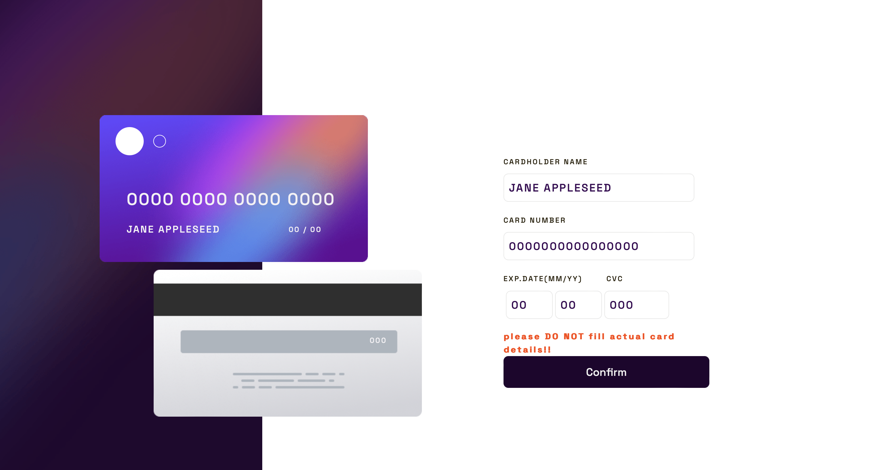
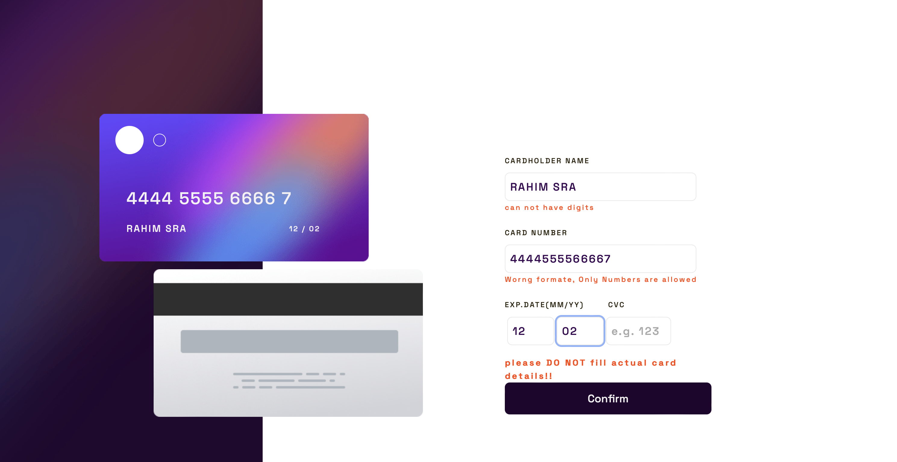

# Frontend Mentor - Interactive card details form solution

This is a solution to the
[Interactive card details form challenge on Frontend Mentor](https://www.frontendmentor.io/challenges/interactive-card-details-form-XpS8cKZDWw).
Frontend Mentor challenges help you improve your coding skills by building
realistic projects.

## Table of contents

- [Overview](#overview)
  - [The challenge](#the-challenge)
  - [Screenshot](#screenshot)
  - [Links](#links)
- [My process](#my-process)
  - [Built with](#built-with)
  - [What I learned](#what-i-learned)
  - [Continued development](#continued-development)
  - [Useful resources](#useful-resources)
- [Author](#author)
- [Acknowledgments](#acknowledgments)

**Note: Delete this note and update the table of contents based on what sections
you keep.**

## Overview

Primary challange was to build the website as close as possible to the original
design materials. I have gone one step further to connect to a hosted databse
and to practise my learnig. It was quiet challanging to accomplish all the
validation using useReducer hoock, but i was able to achieve the goal. 🫡

### The challenge

Users should be able to:

- Fill in the form and see the card details update in real-time
- Receive error messages when the form is submitted if:
  - Any input field is empty
  - The card number, expiry date, or CVC fields are in the wrong format
- View the optimal layout depending on their device's screen size
- Card number is saved in vercel server.

## (please avoid inserting, your card details. Just fill up dummy information).

### Screenshot

#### Deskpot view

#### Error messages

### Links

- Solution URL:
  [Add solution URL here](https://github.com/Ashraf0011/interactive-card-design.git)
- Live Site URL:
  [Add live site URL here](https://interactive-card-design-ten.vercel.app/)

## My process

### Built with

- React
- Styled components
- Flexbox
- CSS Grid
- Mobile-first workflow, However only 2 device sizes were developed
- [React](https://reactjs.org/) - JS library
- [Styled Components](https://styled-components.com/) - For styles

### What I learned

This project was really a good project for me. it helped me learning reducer,
and dispatcher functions properly. at some stage I have connected the app with
MongoBD data base, schema validation was really challanging, not to mention, the
complexity of sending data between two different hostig Vercel (used for
backend) and Netlify (used for fronend).

### Continued development

I would like to add feates like edit and delete a card in the future. I feel
still I need more knowledge on github. it was too much to commit and push every
single changes during last minute change. That's real headech. code structure
was not very organised in this project which gave me a hard time specially
styled components and and making them responsive later on. I'll have to find a
way to organise them differently.

### Useful resources

- [Axios Help](https://blog.logrocket.com/axios-vs-fetch-best-http-requests/) -
  This helped me to solve cors problem. I really liked this pattern and will use
  it going forward.

## Author

- Website - [Md Ashraful islam ](https://ashrafs.info)
- Frontend Mentor -
  [@Ashraf0011](https://www.frontendmentor.io/profile/Ashraf0011)
- Twitter - [@Ashraf_SIndex](https://www.twitter.com/Ashraf_SIndex)

**Note: Delete this note and add/remove/edit lines above based on what links
you'd like to share.**

## Acknowledgments

I would lIke to thank my mentor Md Didarul islam for his effort all my silly
questions. I't becomes really painful to satisfy my q's some times 🥴.
